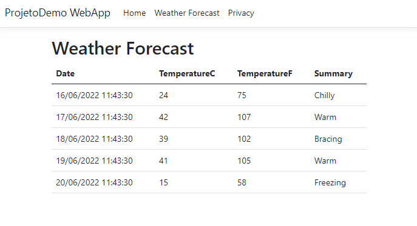
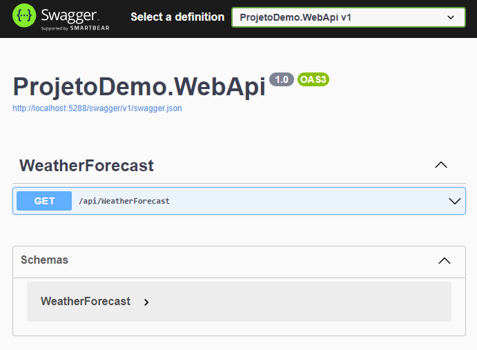
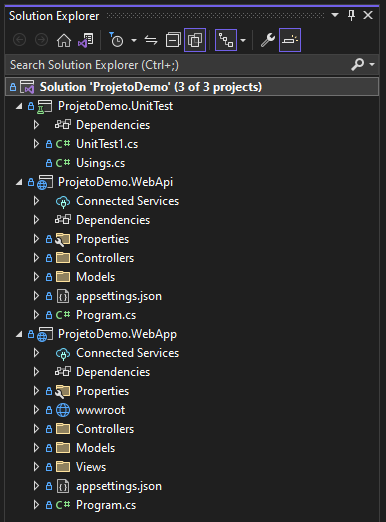
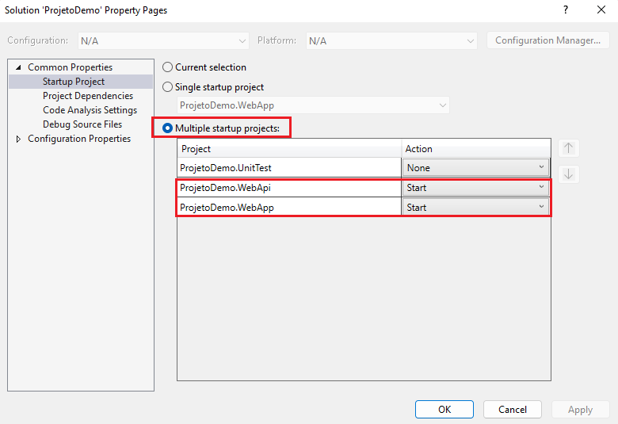
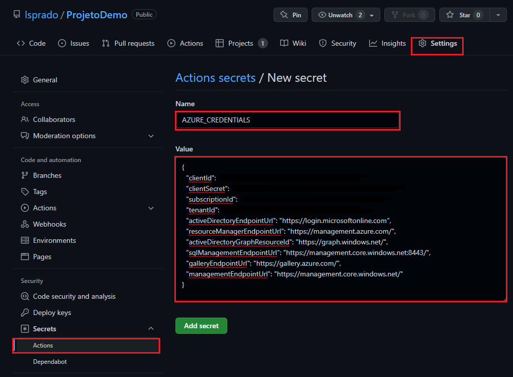
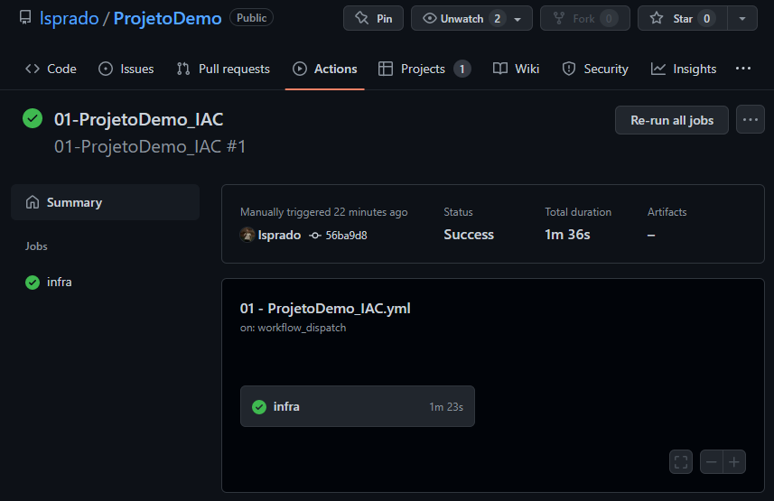
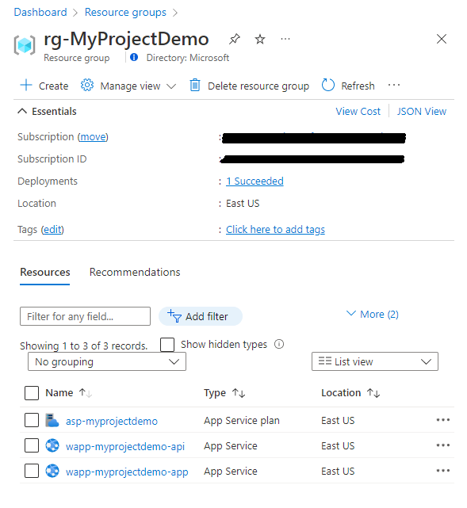
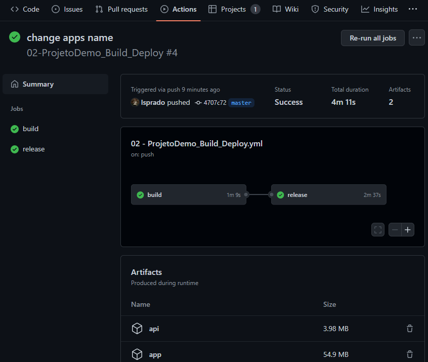
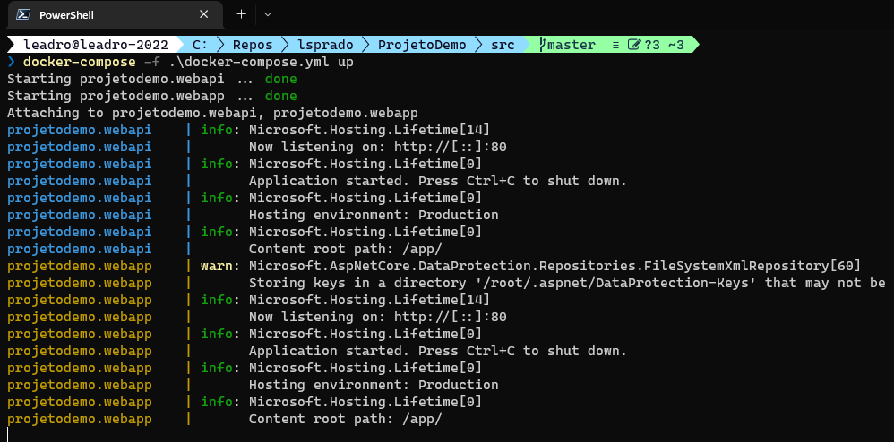
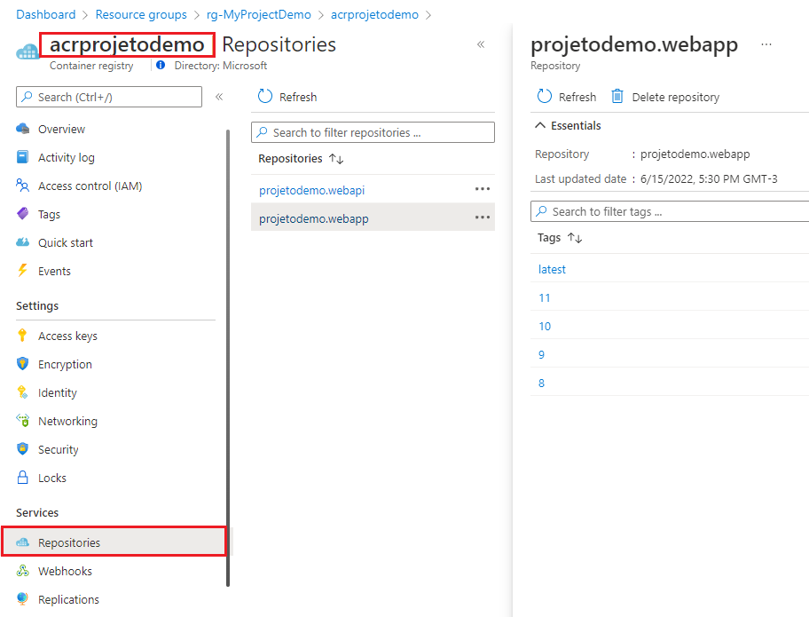

# ProjetoDemo

Demo project using dotnet core MVC application calling a rest API. This project will be published on Azure WebApp.



The rest api is very simple, just a method to simulate the weather forecast.



## src folder
This folder contains all source files for application



- __ProjetoDemo.WebApi:__ dotnet 6 rest api
- __ProjetoDemo.WebApp:__ dotnet 6 web application (mvc)
- __ProjetoDemo.UnitTest:__ xunit test project

## iac folder
This folder contains the bicep files to create Azure environments

- __main.bicep:__ file for creating azure web app

# Running the application locally

1. Install .NET 6 - https://dotnet.microsoft.com/en-us/download/dotnet/6.0

2. Install Visual Studio Community or Visual Studio Code - https://visualstudio.microsoft.com/free-developer-offers/

3. Open the solution file __src/ProjetoDemo.sln__

4. Configure Visual Studio to run multiple projects. Right click in ProjetoDemo solution -> Properties -> Startup Project. Select the option __Multiple startup projects__ and select the projects __ProjetoDemo.WebApi__ and __ProjetoDemo.WebApp__



5. Run the application press F5

# Publishing the app to Azure Web App

If you want to publish this application to Azure using GitHub actions, follow these steps

## Create Azure environment

1. Create resource group for application

```powershell
# set variables
$rgName = 'rg-MyProjectDemo'
$location ='eastus'

# login
az login

# set the correct subscription
az account set --subscription '11111111-2222-3333-4444-55555555'
$SubscriptionId = az account show --query id --output tsv

# check the subscription
az account show

# create resource group
az group create --name $rgName --location $location
```

2. Create service principal to access the Resource Group with contributor role

```powershell
az ad sp create-for-rbac --name spnProjetoDemo --role contributor --scopes /subscriptions/$SubscriptionId/resourceGroups/$rgName --sdk-auth
```

3. Configure the GitHub secrets, select Settings > Secrets > New secret. Paste the entire JSON output from the Azure CLI command into the secret's value field. Name the secret AZURE_CREDENTIALS.



4. Start the GitHub Action __01-ProjetoDemo_IAC__ to run the bicep file and create the Azure environment



5. Go to the Azure portal and verify that the resources were created successfully.



## Deploy Application

1. Get the publish profile for Web Api
```
az webapp deployment list-publishing-profiles --resource-group $rgName --name wapp-MyProjectDemo-api --xml 
```

2. Store the publish profile into a GitHub secret, select Settings > Secrets > New secret. Paste the entire XML output from the Azure CLI command into the secret's value field. Name the secret AZURE_PUBLISH_PROFILE_API.

3. Get the publish profile for Web App
```
az webapp deployment list-publishing-profiles --resource-group $rgName --name wapp-MyProjectDemo-app --xml 
```

4. Store the publish profile into a GitHub secret, select Settings > Secrets > New secret. Paste the entire XML output from the Azure CLI command into the secret's value field. Name the secret AZURE_PUBLISH_PROFILE_APP.

5. Run the GitHub Action __02-ProjetoDemo_Build_Deploy__ to build, test and deploy the application to Azure




# Using Docker

Other option is running this application using container Docker.

# Running the application locally using Docker

1. Generate docker images locally
```powershell
cd .\src\
docker build -t projetodemo.webapp -f  .\ProjetoDemo.WebApp\Dockerfile .
docker build -t projetodemo.webapi -f  .\ProjetoDemo.WebApi\Dockerfile .
```

2. Docker compose locally

```powershell
cd .\src\
docker-compose -f .\docker-compose.yml up
```



# Publishing the app to Azure Web App for Containers

1. Create GibHub secrets for ACR login and ACR password

2. Runn the GH action 03-ProjetoDemo_IAC_Container to create the Azure Environment

3. Run the GitHub Action __04-ProjetoDemo_Container__ to build and push docker images do ACR



# Contribute
Let me know and I'll be glad to invite you !!!, then ...

- Clone this repository: ```git clone https://github.com/lsprado/ProjetoDemo.git```
- Create your feature branch: ```git checkout -b features/my-new-feature```
- Commit your changes: ```git commit -am 'Add some feature'```
- Push to the branch: ```git push origin features/my-new-feature```
- Submit a pull request 😄
